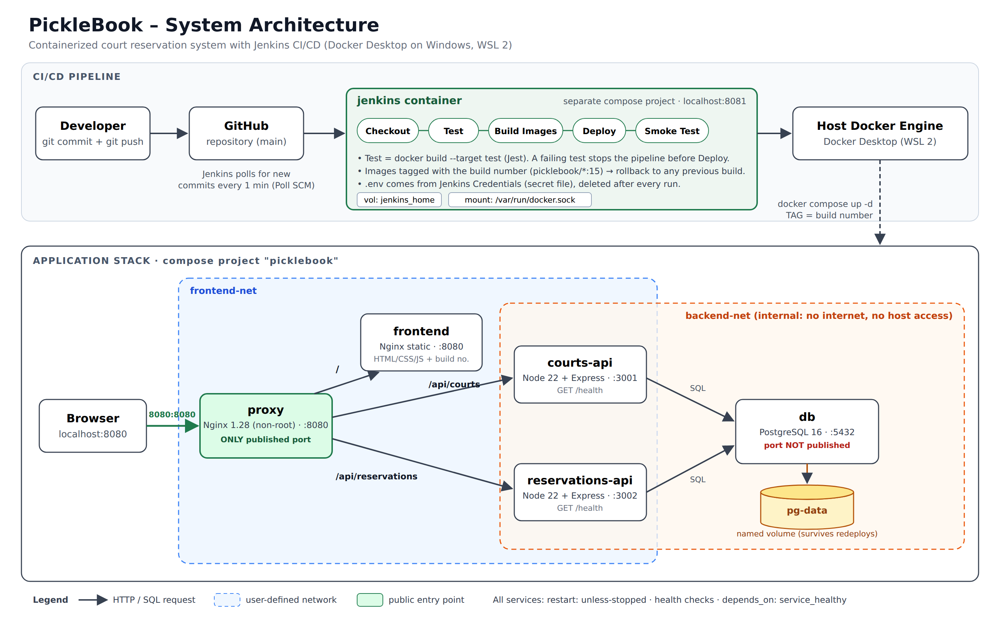

# PickleBook – Court Reservation System

**Systems Integration Final Project: Containerized Infrastructure and CI/CD Automation with Docker and Jenkins**

PickleBook lets players reserve pickleball courts online. Staff can confirm, complete or cancel reservations and add courts. The app is small on purpose. The main part of the project is the infrastructure: every module runs in its own Docker container, and a Jenkins pipeline **automatically tests, builds and deploys** every change pushed to GitHub.



---

## Team PickleBook

| Role | Member | Owns |
|---|---|---|
| Project Lead / Scrum Master | De Guzman, Francis Jeremiah A. | Proposal, task board, demo flow, contribution log |
| DevOps / CI-CD Engineer | Corpuz, Jirek K. | `infra/jenkins/`, `Jenkinsfile`, `Jenkinsfile.rollback`, trigger setup |
| Infrastructure Engineer | Fajardo, Margaret Anne O. | Dockerfiles, `docker-compose.yml`, `proxy/`, architecture diagram |
| Backend & Database Engineer | Imperial, Tyrone Ralf R. | `courts-api/`, `reservations-api/`, `db/init.sql`, unit tests |
| Frontend, QA & Documentation Lead | Verona, Francis Charles P. | `frontend/`, `scripts/smoke-test.sh`, README, docs, slides |

---

## Modules

| Container | Technology | Purpose | Internal port |
|---|---|---|---|
| `proxy` | Nginx 1.28 (unprivileged) | **Only public entry point.** Routes `/` → frontend, `/api/courts` → courts-api, `/api/reservations` → reservations-api | 8080 → published as **8080** |
| `frontend` | Static HTML/CSS/JS on Nginx | Booking form, reservation board, staff "add court" form, shows **build number** | 8080 |
| `courts-api` | Node.js 22 + Express | CRUD for courts and hourly rates | 3001 |
| `reservations-api` | Node.js 22 + Express | Creates bookings, blocks double booking, computes price (peak hours +20%), status changes, summary report | 3002 |
| `db` | PostgreSQL 16 (Alpine) | Tables `courts` and `reservations`. Data kept in named volume `pg-data` | 5432 (**not published**) |
| `jenkins` (separate compose) | Jenkins LTS + Docker CLI | CI/CD server | 8080 → published as **8081** |

### Why we chose this stack

| Choice | Reason |
|---|---|
| **Node.js + Express** for both APIs | One language for the whole group, so everyone can read and test every module. Express is small and quick to build REST APIs with. |
| **Jest + Supertest** | Tests the API routes without a real database (a fake DB is passed in), so tests are fast and run inside Docker. |
| **PostgreSQL 16** | Relational data (a reservation belongs to a court) with foreign keys and CHECK constraints. Official image with a built-in `pg_isready` health check. |
| **Nginx** as reverse proxy | Industry standard, tiny Alpine image, simple path-based routing. The unprivileged image runs as non-root. |
| **Static frontend on Nginx** | No build step needed; the build number is injected at image build time. |
| **GitHub + Poll SCM** | Jenkins runs on a laptop with no public URL. Polling every minute needs no tunnel and works on any network. A webhook via ngrok is optional. |

### Security and good practices applied

- Multi-stage Dockerfiles with a **test stage**. Production images contain no test tools.
- Pinned base images (`node:22-alpine`, `postgres:16-alpine`, `nginx-unprivileged:1.28-alpine`) and a `.dockerignore` per module.
- **All app containers run as non-root** and have a `HEALTHCHECK`.
- Two networks: `frontend-net` (proxy, frontend, APIs) and `backend-net` (APIs, db). `backend-net` is `internal`, so the database has no internet access and cannot be reached by the proxy or frontend.
- Only the proxy publishes a port.
- `depends_on: condition: service_healthy` means db → APIs → proxy start in the correct order.
- Passwords live in `.env`, which is git-ignored. Only `.env.example` is committed. Jenkins gets the real `.env` from **Jenkins Credentials**.

---

## Repository structure

```
picklebook/
├── Jenkinsfile                 # main CI/CD pipeline (pipeline as code)
├── Jenkinsfile.rollback        # parameterized rollback pipeline
├── docker-compose.yml          # application stack
├── .env.example                # placeholder config (real .env is NOT committed)
├── .gitignore / .gitattributes
├── README.md
├── docs/
│   ├── architecture.png
│   ├── architecture-source.html   # editable source of the diagram (open in a browser)
│   └── demo-script-and-qa.md      # presentation demo steps + Q&A prep
├── proxy/          Dockerfile, nginx.conf
├── frontend/       Dockerfile, nginx.conf, public/ (index.html, app.js, styles.css)
├── courts-api/     Dockerfile, package.json, src/, tests/
├── reservations-api/ Dockerfile, package.json, src/, tests/
├── db/             Dockerfile, init.sql
├── scripts/        smoke-test.sh
└── infra/jenkins/  Dockerfile, docker-compose.yml   # Jenkins deployed separately
```

---

## Setup on Windows (step by step)

### 0. Prerequisites

1. Install **Docker Desktop** (turn on "Use the WSL 2 based engine") and **Git for Windows**.
2. Recommended: at least 8 GB RAM. If Docker is slow, create `C:\Users\<you>\.wslconfig` with:
   ```
   [wsl2]
   memory=6GB
   ```
   then run `wsl --shutdown` and restart Docker Desktop.
3. Check in PowerShell:
   ```powershell
   docker version
   docker compose version
   git --version
   docker run hello-world
   ```

### 1. Run the app by hand first

```powershell
git clone https://github.com/<your-org>/picklebook.git
cd picklebook
copy .env.example .env        # then open .env and change DB_PASSWORD
docker compose up -d --build
docker compose ps             # wait until every service shows "healthy"
```

Open **http://localhost:8080**. The badge shows **Build dev**.

Check that data persists:

```powershell
docker compose down           # WITHOUT -v
docker compose up -d
```

Your reservations are still there.

> ⚠️ Never run `docker compose down -v` unless you want to **delete the database**.

### 2. Start Jenkins

```powershell
cd infra\jenkins
docker compose up -d --build
docker exec jenkins cat /var/jenkins_home/secrets/initialAdminPassword
```

1. Open **http://localhost:8081** and paste the password.
2. Click **Install suggested plugins**, then create your admin user. The project's extra plugins (Stage View, Docker Pipeline, GitHub) are already installed by our Dockerfile.
3. Check that Jenkins can control Docker:
   ```powershell
   docker exec jenkins docker ps
   ```

### 3. Add the secret `.env` to Jenkins

**Manage Jenkins → Credentials → System → Global credentials → Add Credentials**

- Kind: **Secret file**
- File: upload your real `.env`
- ID: **`picklebook-env`** (must match exactly)

If your GitHub repository is **private**, also add a **Username with password** credential. The username is your GitHub username and the password is a GitHub Personal Access Token. Select it in step 4.

> Tip: use the **same** `.env` values in Jenkins and in your local copy, so manual commands and Jenkins deployments use the same database password.

### 4. Create the pipeline job

1. **New Item** → name `picklebook` → **Pipeline** → OK.
2. Under **Pipeline**:
   - Definition: **Pipeline script from SCM**
   - SCM: **Git**
   - Repository URL: your GitHub repo URL
   - Branch: `*/main`
   - Script Path: `Jenkinsfile`
3. Save, then click **Build Now once**.
   - This first run is setup only: it lets Jenkins read the `pollSCM` trigger from the Jenkinsfile.
   - From then on, every `git push` to `main` starts a build automatically within about 1 minute.
4. When it is green, open http://localhost:8080. The badge shows **Build 1**.

### 5. Create the rollback job (bonus)

1. **New Item** → `picklebook-rollback` → **Pipeline**.
2. Configure it the same as step 4, but set Script Path to `Jenkinsfile.rollback`.
3. Click **Build Now** once. This first run is expected to fail. It teaches Jenkins the `ROLLBACK_TAG` parameter.
4. After that, use **Build with Parameters** and enter a build number, for example `3`.

### Optional: instant builds with a GitHub webhook

1. Run `ngrok http 8081` and copy the https URL.
2. In GitHub go to **Settings → Webhooks → Add webhook**:
   - Payload URL: `https://<ngrok-url>/github-webhook/`
   - Content type: `application/json`
   - Events: push events
3. In the `Jenkinsfile`, uncomment `githubPush()`.
4. In the job, tick **GitHub hook trigger for GITScm polling**.

Keep Poll SCM as a backup in case the internet fails during the demo.

---

## The pipeline

| Stage | What it does | If it fails |
|---|---|---|
| **Checkout** | Gets the pushed commit from GitHub | Nothing is deployed |
| **Test** | `docker build --target test` for both APIs. This runs 33 Jest tests inside Docker, so no Node.js is needed on the Jenkins host | **Quality gate:** the pipeline stops and the running site stays on the previous build |
| **Build Images** | `docker compose build` and tags every image `picklebook/<service>:<BUILD_NUMBER>` | Nothing is deployed |
| **Deploy** | Copies `.env` from Jenkins Credentials, then runs `docker compose up -d --no-build`. Only changed containers are replaced. The `pg-data` volume is kept | Old containers keep running |
| **Smoke Test** | Through the proxy, checks both `/health` endpoints (including the DB connection) and that the page serves the **new build number** | **Automatic rollback** to the last successful build, then the build is marked failed |
| **post** | Success: prints the URL and archives `deploy-report.txt`. Failure: explains what to do. Always: deletes `.env` and prunes dangling images | — |

## Manual rollback from PowerShell

This uses images that are already on your machine:

```powershell
cd picklebook
$env:TAG = "3"
docker compose up -d --no-build
Remove-Item Env:TAG
```

You can also use the `picklebook-rollback` Jenkins job. The next successful push deploys the newest version again.

---

## API reference (all through http://localhost:8080)

| Method | Path | Description |
|---|---|---|
| GET | `/api/courts` (`?active=true`) | List courts |
| GET | `/api/courts/:id` | One court |
| POST | `/api/courts` | `{ name, surface, hourly_rate }` |
| PUT | `/api/courts/:id` | Update any of `name, surface, hourly_rate, is_active` |
| GET | `/api/courts/health` | Health check (includes DB) |
| GET | `/api/reservations` (`?date=YYYY-MM-DD&status=pending`) | List reservations |
| GET | `/api/reservations/:id` | One reservation |
| POST | `/api/reservations` | `{ court_id, customer_name, contact, play_date, start_hour, hours }`. Returns 409 if the slot is taken |
| PATCH | `/api/reservations/:id/status` | `{ status }`. Allowed: pending→confirmed/cancelled, confirmed→completed/cancelled |
| GET | `/api/reservations/summary` | Counts per status and revenue |
| GET | `/api/reservations/health` | Health check (includes DB) |

Business rules:
- Open 6:00 AM–11:00 PM.
- 1–4 hours per booking.
- Hours from 5 PM onwards are **peak** and cost 20% more.
- No overlapping pending or confirmed bookings on the same court.
- No past dates (Philippine time).

## Run the tests without Docker (optional)

```powershell
cd courts-api;       npm install; npm test
cd ..\reservations-api; npm install; npm test
```

---

## Troubleshooting

| Problem | Fix |
|---|---|
| `required variable DB_USER is missing` | You have no `.env`. Copy `.env.example` to `.env`. In Jenkins, check the credential ID is `picklebook-env`. |
| Jenkins: `permission denied ... docker.sock` | Jenkins must run with `user: root` (already set in `infra/jenkins/docker-compose.yml`). Rebuild with `docker compose up -d --build`. |
| Pushes do not start builds | Click **Build Now** once after creating the job, so Jenkins registers the Poll SCM trigger. Check **Git Polling Log** in the job. |
| Port 8080 already in use | Change `HTTP_PORT` in `.env` (and in the Jenkins secret file), for example `HTTP_PORT=8088`. |
| `exec format error` or `\r` errors in scripts | Line endings were converted to Windows format. The repo's `.gitattributes` prevents this; re-clone after committing it. |
| Page still shows the old build | Hard refresh with Ctrl+F5. |
| Changed `db/init.sql` but nothing happened | It only runs on an **empty** volume. For a fresh DB during development only: `docker compose down -v`, then `up -d`. |

## Security note (for the presentation)

Jenkins mounts `/var/run/docker.sock` and runs as `root`, which gives it **full control of the host's Docker**. Anyone who controls a Jenkinsfile could start any container on the machine. That is acceptable in a classroom lab, but not in production. Safer alternatives:

- dedicated build agents
- rootless Docker
- Docker-in-Docker with TLS
- Kaniko / BuildKit for daemonless builds
- deploying to a separate server over SSH
